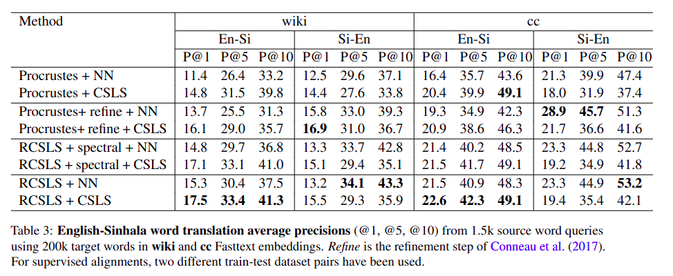
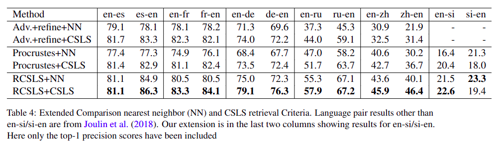

# Sinhala-English word-embedding Alignment

This repository contains the resources related to our research on English-Sinhala word embedding alignment.

- **alignment_matrices/** contains the alignment matrices obtained using different alignment techniques in different directions (i.e. Si --> En and En --> Si).
- **all_data/** contains all the datasets we used for the supervised alignment. The datasets have been created using the large datasets provided in [this](https://github.com/kasunw22/sinhala-para-dict/tree/main) repository.
- **muse_content/** contains the scripts used for ***iterative Procrustes*** alignment which have been adopted from [this](https://github.com/facebookresearch/MUSE/tree/main) repository by facebook-research.
- **rcsls_content/** contains the scripts used for ***RCSLS*** alignment which have been adopted from [the FastText](https://github.com/facebookresearch/fastText/tree/main/alignment) repository by facebook-research.

## Results from the Paper

### Alignement results obtained for Sinhala-English alignment according to the paper:


### Comparision of Sinhala-English alignment with other language pairs according to the paper:


[//]: # (|   src-tgt  | German | English | Spanish | French | Italian | Portuguese |)

[//]: # (|:----------:|:------:|:-------:|:-------:|:------:|:-------:|:----------:|)

[//]: # (| German | - | | | | |)


## BibTex Citation
If you are willing to use this work, please be kind enough to cite the following papers.

### [Dataset paper](https://arxiv.org/abs/2308.02234):
```
@article{wickramasinghe2023sinhala,
  title={Sinhala-English Parallel Word Dictionary Dataset},
  author={Wickramasinghe, Kasun and de Silva, Nisansa},
  journal={arXiv preprint arXiv:2308.02234},
  year={2023}
}
```

### [Word Embedding Alignment paper](https://arxiv.org/abs/2308.02234): 
```
@article{xxxxxx,
  title={Sinhala-English Word Embedding Alignment: Introducing Datasets and Benchmark for a Low Resource Language},
  author={Wickramasinghe, Kasun and de Silva, Nisansa},
  journal={xxxxx},
  year={2023}
}
```
