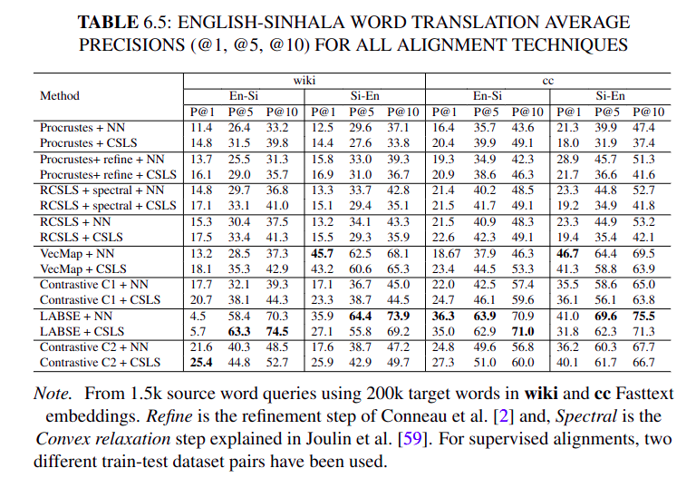

# Sinhala-English word-embedding Alignment

This repository contains the resources related to our research on English-Sinhala word embedding alignment.

- **alignment_matrices/** contains the alignment matrices obtained using different alignment techniques in different directions (i.e. Si --> En and En --> Si).
- **all_data/** contains all the datasets we used for the supervised alignment. The datasets have been created using the large datasets provided in [this](https://github.com/kasunw22/sinhala-para-dict/tree/main) repository.
- **muse_content/** contains the scripts used for ***iterative Procrustes*** alignment which have been adopted from [this](https://github.com/facebookresearch/MUSE/tree/main) repository by facebook-research.
- **rcsls_content/** contains the scripts used for ***RCSLS*** alignment which have been adopted from [the FastText](https://github.com/facebookresearch/fastText/tree/main/alignment) repository by facebook-research.
- **vecmap_content/** contains the scripts used for ***VecMap*** alignment which have been adopted from [the VecMap](https://github.com/artetxem/vecmap/tree/master) repository.
- **contrastive_bli_content/** contains the scripts used for ***ContranstiveBLI*** alignment which have been adopted from [the ContranstiveBLI](https://github.com/cambridgeltl/ContrastiveBLI/tree/main) repository.

## Results from the Papers

### Alignment results obtained for Sinhala-English alignment according to the paper:


### Comparison of Sinhala-English alignment with other language pairs according to the paper:


## Next Work

### Alignment results obtained for Sinhala-English alignment from further studies (publication is under review):


## Publications
If you are willing to use this work, please be kind enough to cite the following papers.

### [Dataset paper](https://arxiv.org/abs/2308.02234):

```
@INPROCEEDINGS{10253560,
  author={Wickramasinghe, Kasun and De Silva, Nisansa},
  booktitle={2023 IEEE 17th International Conference on Industrial and Information Systems (ICIIS)}, 
  title={Sinhala-English Parallel Word Dictionary Dataset}, 
  year={2023},
  volume={},
  number={},
  pages={61-66},
  keywords={Dictionaries;Annotations;Pipelines;Machine translation;Task analysis;Information systems;parallel corpus;alignment;English-Sinhala dictionary;word embedding alignment;lexicon induction},
  doi={10.1109/ICIIS58898.2023.10253560}}
```

### [Word Embedding Alignment paper](https://aclanthology.org/2023.paclic-1.42/): 
```
@inproceedings{wickramasinghe-de-silva-2023-sinhala,
    title = "{S}inhala-{E}nglish Word Embedding Alignment: Introducing Datasets and Benchmark for a Low Resource Language",
    author = "Wickramasinghe, Kasun  and
      de Silva, Nisansa",
    editor = "Huang, Chu-Ren  and
      Harada, Yasunari  and
      Kim, Jong-Bok  and
      Chen, Si  and
      Hsu, Yu-Yin  and
      Chersoni, Emmanuele  and
      A, Pranav  and
      Zeng, Winnie Huiheng  and
      Peng, Bo  and
      Li, Yuxi  and
      Li, Junlin",
    booktitle = "Proceedings of the 37th Pacific Asia Conference on Language, Information and Computation",
    month = dec,
    year = "2023",
    address = "Hong Kong, China",
    publisher = "Association for Computational Linguistics",
    url = "https://aclanthology.org/2023.paclic-1.42",
    pages = "424--435",
}
```
